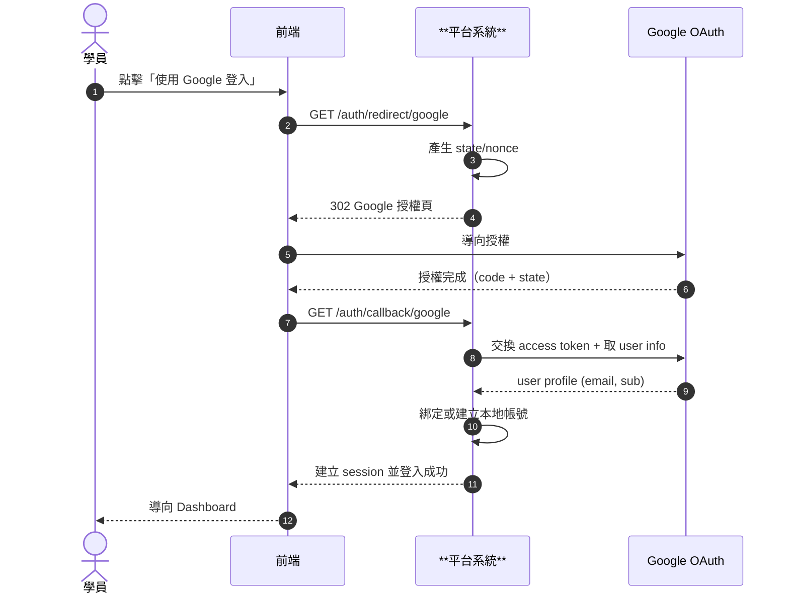
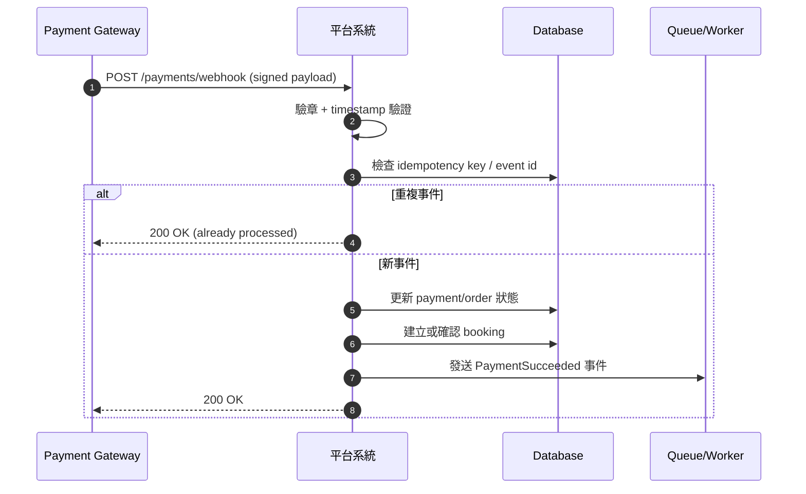
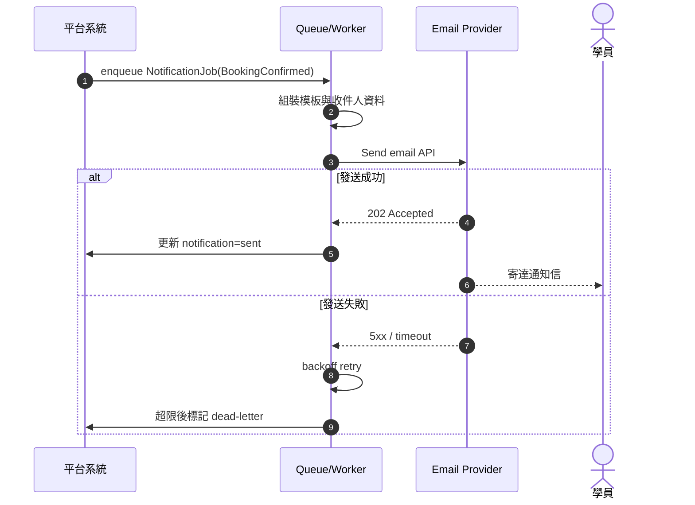
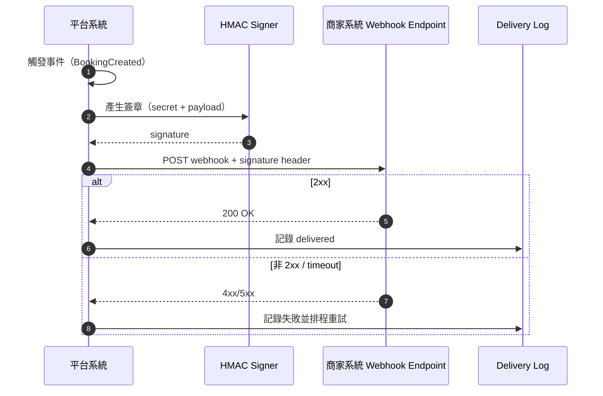

# 第三方整合 Sequence Diagram（Mermaid）

## 1) 第三方登入（Google OAuth）

```mermaid
sequenceDiagram
    autonumber
    actor Member as 學員
    participant Frontend as 前端
    participant Platform as **平台系統**
    participant Google as Google OAuth

    Member->>Frontend: 點擊「使用 Google 登入」
    Frontend->>Platform: GET /auth/redirect/google
    Platform->>Platform: 產生 state/nonce
    Platform-->>Frontend: 302 Google 授權頁
    Frontend->>Google: 導向授權
    Google-->>Frontend: 授權完成（code + state）
    Frontend->>Platform: GET /auth/callback/google
    Platform->>Google: 交換 access token + 取 user info
    Google-->>Platform: user profile (email, sub)
    Platform->>Platform: 綁定或建立本地帳號
    Platform-->>Frontend: 建立 session 並登入成功
    Frontend-->>Member: 導向 Dashboard
```

## 2) 金流 Webhook 回寫

```mermaid
sequenceDiagram
    autonumber
    participant Gateway as Payment Gateway
    participant Platform as 平台系統
    participant DB as Database
    participant Queue as Queue/Worker

    Gateway->>Platform: POST /payments/webhook (signed payload)
    Platform->>Platform: 驗章 + timestamp 驗證
    Platform->>DB: 檢查 idempotency key / event id
    alt 重複事件
        Platform-->>Gateway: 200 OK (already processed)
    else 新事件
        Platform->>DB: 更新 payment/order 狀態
        Platform->>DB: 建立或確認 booking
        Platform->>Queue: 發送 PaymentSucceeded 事件
        Platform-->>Gateway: 200 OK
    end
```

## 3) 預約成功通知（Email）

```mermaid
sequenceDiagram
    autonumber
    participant Platform as 平台系統
    participant Queue as Queue/Worker
    participant Email as Email Provider
    actor Member as 學員

    Platform->>Queue: enqueue NotificationJob(BookingConfirmed)
    Queue->>Queue: 組裝模板與收件人資料
    Queue->>Email: Send email API
    alt 發送成功
        Email-->>Queue: 202 Accepted
        Queue->>Platform: 更新 notification=sent
        Email-->>Member: 寄達通知信
    else 發送失敗
        Email-->>Queue: 5xx / timeout
        Queue->>Queue: backoff retry
        Queue->>Platform: 超限後標記 dead-letter
    end
```

## 4) 對外 Webhook 推送

```mermaid
sequenceDiagram
    autonumber
    participant Platform as 平台系統
    participant Signer as HMAC Signer
    participant Receiver as 商家系統 Webhook Endpoint
    participant Log as Delivery Log

    Platform->>Platform: 觸發事件（BookingCreated）
    Platform->>Signer: 產生簽章（secret + payload）
    Signer-->>Platform: signature
    Platform->>Receiver: POST webhook + signature header
    alt 2xx
        Receiver-->>Platform: 200 OK
        Platform->>Log: 記錄 delivered
    else 非 2xx / timeout
        Receiver-->>Platform: 4xx/5xx
        Platform->>Log: 記錄失敗並排程重試
    end
```
