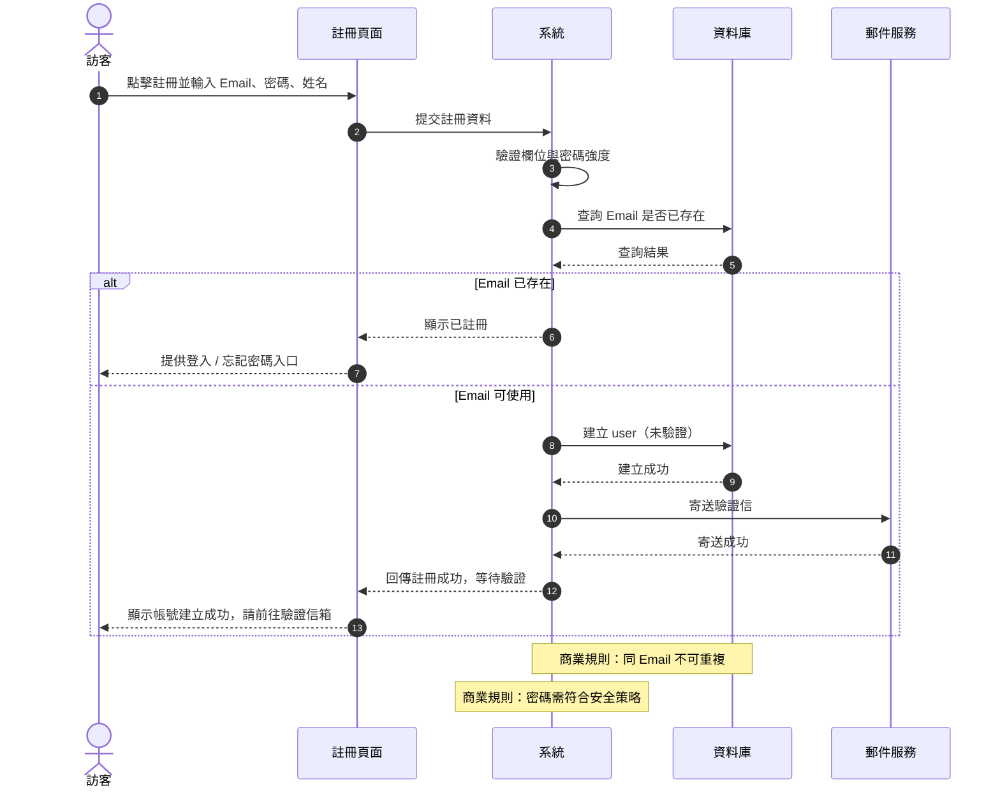

# UC-01 訪客註冊 Sequence

```mermaid
sequenceDiagram
    autonumber
    actor 訪客
    participant 註冊頁面
    participant 系統
    participant 資料庫
    participant 郵件服務

    訪客->>註冊頁面: 點擊註冊並輸入 Email、密碼、姓名
    註冊頁面->>系統: 提交註冊資料
    系統->>系統: 驗證欄位與密碼強度
    系統->>資料庫: 查詢 Email 是否已存在
    資料庫-->>系統: 查詢結果

    alt Email 已存在
        系統-->>註冊頁面: 顯示已註冊
        註冊頁面-->>訪客: 提供登入 / 忘記密碼入口
    else Email 可使用
        系統->>資料庫: 建立 user（未驗證）
        資料庫-->>系統: 建立成功
        系統->>郵件服務: 寄送驗證信
        郵件服務-->>系統: 寄送成功
        系統-->>註冊頁面: 回傳註冊成功，等待驗證
        註冊頁面-->>訪客: 顯示帳號建立成功，請前往驗證信箱
    end

    Note over 系統,資料庫: 商業規則：同 Email 不可重複
    Note over 系統: 商業規則：密碼需符合安全策略
```