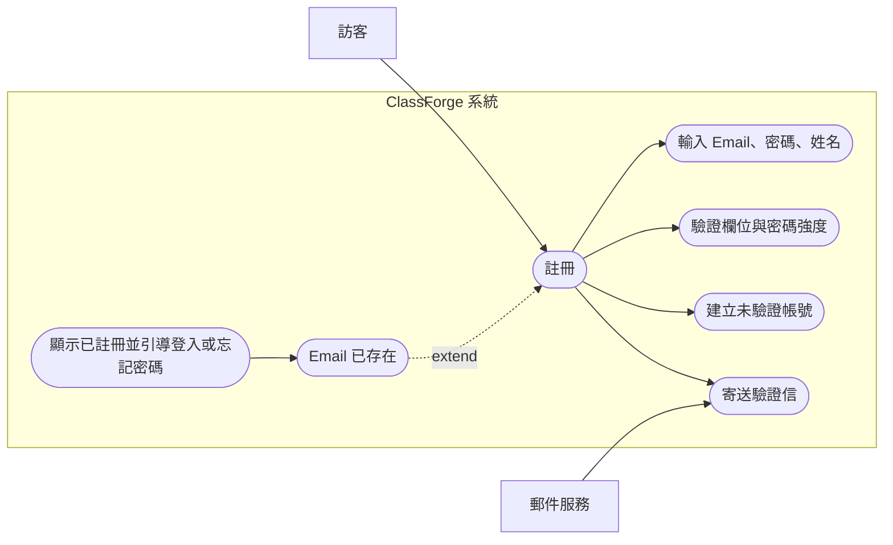

# UC-01 訪客註冊 Use Case

```mermaid
flowchart LR
    guest[訪客]

    subgraph classforge[ClassForge 系統]
        register([註冊])
        input([輸入 Email、密碼、姓名])
        validate([驗證欄位與密碼強度])
        createAccount([建立未驗證帳號])
        sendVerification([寄送驗證信])
        emailExists([Email 已存在])
        redirectHint([顯示已註冊並引導登入或忘記密碼])
    end

    mailService[郵件服務]

    guest --> register
    register --> input
    register --> validate
    register --> createAccount
    register --> sendVerification

    emailExists -.extend.-> register
    redirectHint --> emailExists
    mailService --> sendVerification
```

## 說明

- 主要角色：訪客
- 前置條件：無
- 觸發條件：點擊註冊
- 後置條件：帳號建立成功，等待驗證
- 商業規則：同 Email 不可重複；密碼需符合安全策略
