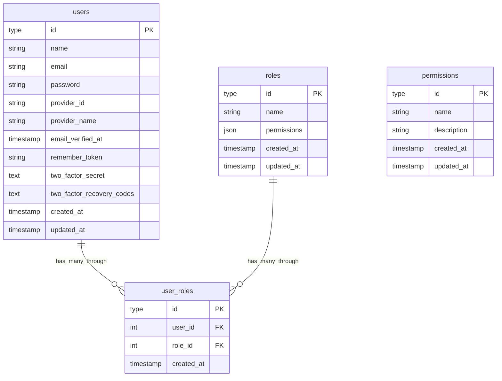

# Database 設計

```mermaid
erDiagram
    users {
        type id PK
        string name
        string email
        string password
        string provider_id
        string provider_name
        timestamp email_verified_at
        string remember_token
        text two_factor_secret
        text two_factor_recovery_codes
        timestamp created_at
        timestamp updated_at
    }

    roles {
        type id PK
        string name
        json permissions
        timestamp created_at
        timestamp updated_at
    }

    user_roles {
        type id PK
        int user_id FK
        int role_id FK
        timestamp created_at
    }

    permissions {
        type id PK
        string name
        string description
        timestamp created_at
        timestamp updated_at
    }

    users ||--o{ user_roles : has_many_through
    roles ||--o{ user_roles : has_many_through

```
