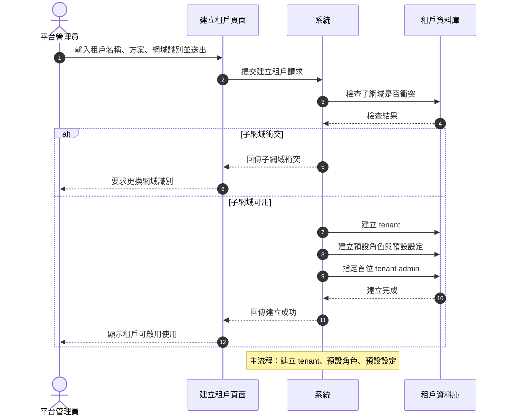

# UC-04 平台建立租戶 Sequence

```mermaid
sequenceDiagram
    autonumber
    actor 平台管理員
    participant 建立租戶頁面
    participant 系統
    participant 租戶資料庫

    平台管理員->>建立租戶頁面: 輸入租戶名稱、方案、網域識別並送出
    建立租戶頁面->>系統: 提交建立租戶請求
    系統->>租戶資料庫: 檢查子網域是否衝突
    租戶資料庫-->>系統: 檢查結果

    alt 子網域衝突
        系統-->>建立租戶頁面: 回傳子網域衝突
        建立租戶頁面-->>平台管理員: 要求更換網域識別
    else 子網域可用
        系統->>租戶資料庫: 建立 tenant
        系統->>租戶資料庫: 建立預設角色與預設設定
        系統->>租戶資料庫: 指定首位 tenant admin
        租戶資料庫-->>系統: 建立完成
        系統-->>建立租戶頁面: 回傳建立成功
        建立租戶頁面-->>平台管理員: 顯示租戶可啟用使用
    end

    Note over 系統: 主流程：建立 tenant、預設角色、預設設定
```
