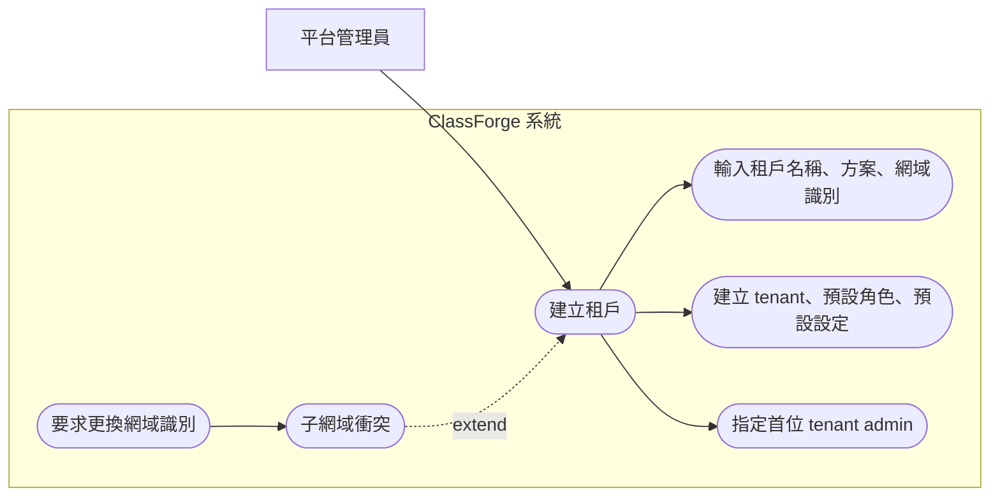

# UC-04 平台建立租戶 Use Case

```mermaid
flowchart LR
    platformAdmin[平台管理員]

    subgraph classforge[ClassForge 系統]
        createTenant([建立租戶])
        inputTenantData([輸入租戶名稱、方案、網域識別])
        createResources([建立 tenant、預設角色、預設設定])
        assignFirstAdmin([指定首位 tenant admin])
        subdomainConflict([子網域衝突])
        requestReplacement([要求更換網域識別])
    end

    platformAdmin --> createTenant
    createTenant --> inputTenantData
    createTenant --> createResources
    createTenant --> assignFirstAdmin

    subdomainConflict -.extend.-> createTenant
    requestReplacement --> subdomainConflict
```

## 說明

- 主要角色：平台管理員
- 前置條件：平台管理員已登入
- 觸發條件：建立新商家
- 後置條件：租戶可啟用使用
