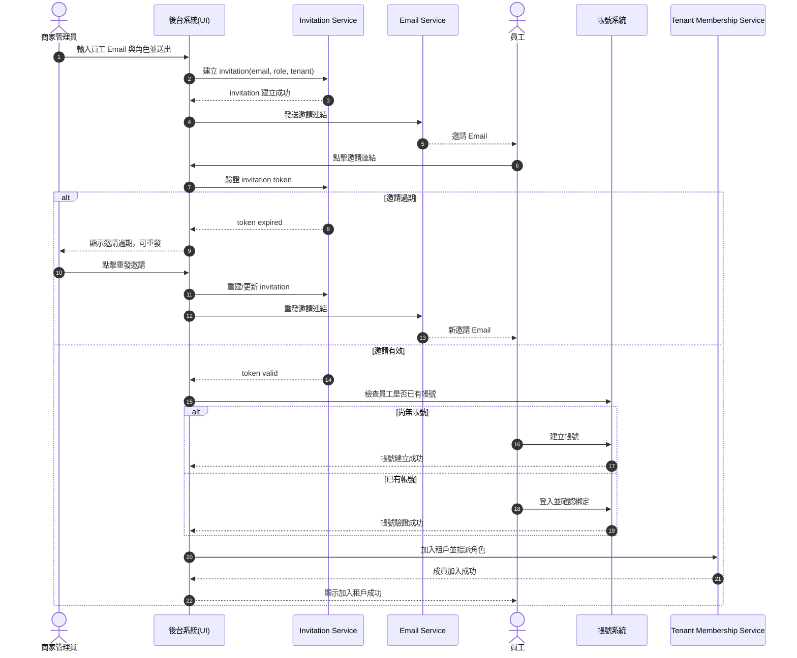

# UC-05 租戶邀請員工 - Sequence Diagram

```mermaid
sequenceDiagram
    autonumber
    actor Admin as 商家管理員
    participant UI as 後台系統(UI)
    participant InviteSvc as Invitation Service
    participant Mailer as Email Service
    actor Employee as 員工
    participant Auth as 帳號系統
    participant TenantSvc as Tenant Membership Service

    Admin->>UI: 輸入員工 Email 與角色並送出
    UI->>InviteSvc: 建立 invitation(email, role, tenant)
    InviteSvc-->>UI: invitation 建立成功
    UI->>Mailer: 發送邀請連結
    Mailer-->>Employee: 邀請 Email

    Employee->>UI: 點擊邀請連結
    UI->>InviteSvc: 驗證 invitation token

    alt 邀請過期
        InviteSvc-->>UI: token expired
        UI-->>Admin: 顯示邀請過期，可重發
        Admin->>UI: 點擊重發邀請
        UI->>InviteSvc: 重建/更新 invitation
        UI->>Mailer: 重發邀請連結
        Mailer-->>Employee: 新邀請 Email
    else 邀請有效
        InviteSvc-->>UI: token valid
        UI->>Auth: 檢查員工是否已有帳號
        alt 尚無帳號
            Employee->>Auth: 建立帳號
            Auth-->>UI: 帳號建立成功
        else 已有帳號
            Employee->>Auth: 登入並確認綁定
            Auth-->>UI: 帳號驗證成功
        end
        UI->>TenantSvc: 加入租戶並指派角色
        TenantSvc-->>UI: 成員加入成功
        UI-->>Employee: 顯示加入租戶成功
    end
```
