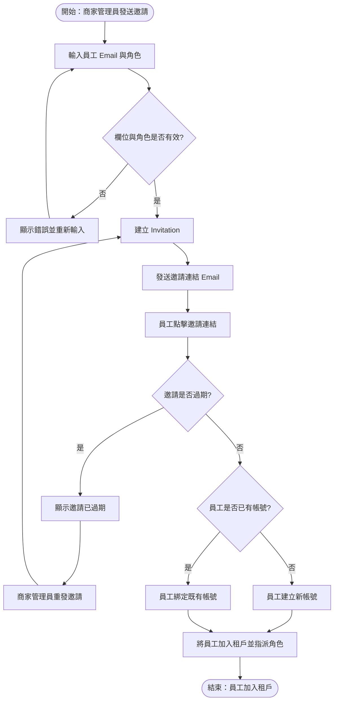

# UC-05 租戶邀請員工 - Use Case Flowchart

```mermaid
flowchart TD
    A([開始：商家管理員發送邀請]) --> B[輸入員工 Email 與角色]
    B --> C{欄位與角色是否有效?}
    C -- 否 --> B1[顯示錯誤並重新輸入]
    B1 --> B
    C -- 是 --> D[建立 Invitation]
    D --> E[發送邀請連結 Email]
    E --> F[員工點擊邀請連結]
    F --> G{邀請是否過期?}
    G -- 是 --> H[顯示邀請已過期]
    H --> I[商家管理員重發邀請]
    I --> D
    G -- 否 --> J{員工是否已有帳號?}
    J -- 否 --> K[員工建立新帳號]
    J -- 是 --> L[員工綁定既有帳號]
    K --> M[將員工加入租戶並指派角色]
    L --> M
    M --> N([結束：員工加入租戶])
```
